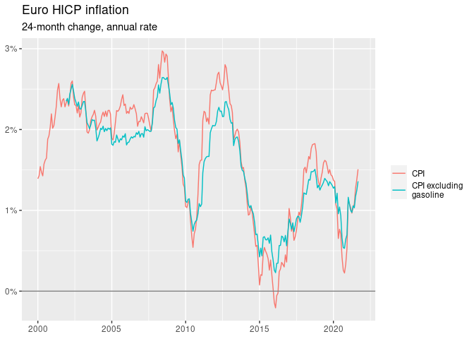
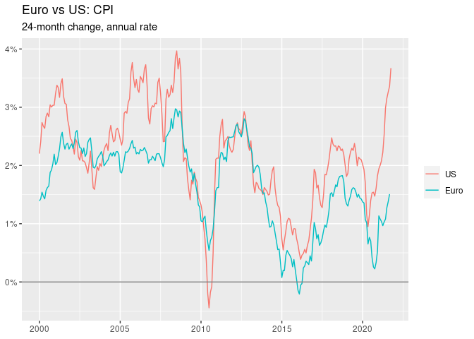
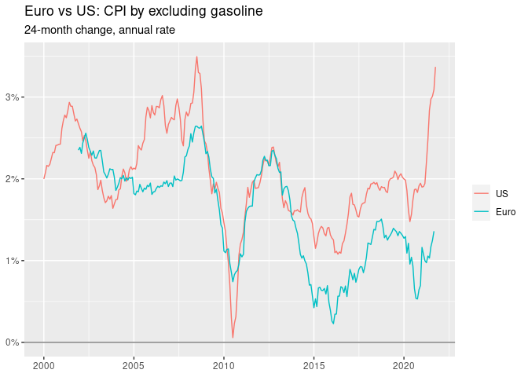

CPI, US vs Euro by excluding gasoline
================
Mitsuo Shiota
2019-03-19

-   [Get US data](#get-us-data)
-   [Get Euro data](#get-euro-data)
-   [Compare US CPI and Euro HICP](#compare-us-cpi-and-euro-hicp)

Updated: 2021-11-11

## Get US data

I get data from FRED.

``` r
us_cpi_symbols <- c(
  "CPIAUCNS", # Unemployment rate
  "CUUR0000SETB01" # Gasoline (All Types) in US City Average
  ) 

us_cpi_data <- us_cpi_symbols %>% 
  tq_get(get = "economic.data", from = "1998-01-01")
```

    ## Registered S3 method overwritten by 'tune':
    ##   method                   from   
    ##   required_pkgs.model_spec parsnip

    ## Warning: `type_convert()` only converts columns of type 'character'.
    ## - `df` has no columns of type 'character'

    ## Warning: `type_convert()` only converts columns of type 'character'.
    ## - `df` has no columns of type 'character'

To calculate inflation contributed by gasoline, I use the fixed
component share of 2.811 percent.
<https://www.bls.gov/cpi/factsheets/motor-fuel.htm>

``` r
us_cpi_wide <- us_cpi_data %>% 
  as_tsibble(key = symbol, index = date) %>% 
  mutate(date = yearmonth(date)) %>% 
  pivot_wider(names_from = symbol, values_from = price) %>% 
  rename(cpi = CPIAUCNS, gas = CUUR0000SETB01) %>% 
  tq_gr(n = 24, annualize = 1/2, pct = FALSE) %>% 
  filter(!is.na(cpi)) %>% 
  mutate(
    gas_contr = gas * 0.02811, # component share as of December 2020
    cpi_excl_gas = cpi - gas_contr
  ) %>% 
  select(-starts_with("gas"))

us_cpi_wide %>% 
  pivot_longer(starts_with("cpi")) %>% 
  ggplot(aes(date, value, color = name)) +
  geom_line() +
  geom_hline(yintercept = 0, color = "gray50") +
  scale_y_continuous(labels = scales::percent_format(accuracy = 1)) +
  scale_color_discrete(labels = c("CPI", "CPI excluding\ngasoline")) +
  labs(x = NULL, y = NULL, color = NULL,
       title = "US CPI inflation",
       subtitle = "24-month change, annual rate")
```

<!-- -->

## Get Euro data

I get data from Eurostat.

``` r
ea19_hicp <- eurostat::get_eurostat(id = "prc_hicp_midx",
                                 filters = list(
                                   unit = "I15",
                                   geo = "EA19",
                                   coicop = c("CP00", "CP0722"))
                                 )
```

To calculate inflation contributed by gasoline, I use the fixed
component share of 3.667 percent. 1.8.2.2 Fuels and lubricants for
personal transport equipment.
<https://www.ecb.europa.eu/stats/ecb_statistics/escb/html/table.en.html?id=JDF_ICP_COICOP_INW>

``` r
ea19_hicp_wide <- ea19_hicp %>% 
  select(-unit, -geo) %>% 
  mutate(date = yearmonth(time)) %>% 
  select(-time) %>% 
  as_tsibble(key = coicop, index = date) %>% 
  pivot_wider(names_from = coicop, values_from = values) %>% 
  rename(cpi = CP00, gas = CP0722) %>% 
  tq_gr(n = 24, annualize = 1/2, pct = FALSE) %>% 
  filter(date >= yearmonth("2000-01-01")) %>% 
  mutate(
    gas_contr = gas * 0.03667, # 
    cpi_excl_gas = cpi - gas_contr
  ) %>% 
  select(-starts_with("gas"))

ea19_hicp_wide %>% 
  pivot_longer(starts_with("cpi")) %>% 
  ggplot(aes(date, value, color = name)) +
  geom_line() +
  geom_hline(yintercept = 0, color = "gray50") +
  scale_y_continuous(labels = scales::percent_format(accuracy = 1)) +
  scale_color_discrete(labels = c("CPI", "CPI excluding\ngasoline")) +
  labs(x = NULL, y = NULL, color = NULL,
       title = "Euro HICP inflation",
       subtitle = "24-month change, annual rate")
```

    ## Warning: Removed 25 row(s) containing missing values (geom_path).

<!-- -->

## Compare US CPI and Euro HICP

I replicate the chart by Jason Furman.
<https://twitter.com/jasonfurman/status/1458568877479055366?ref_src=twsrc%5Egoogle%7Ctwcamp%5Eserp%7Ctwgr%5Etweet>

``` r
combo <- bind_cols(
  us_cpi_wide %>% 
    rename(us_cpi = cpi, us_cpi_excl_gas = cpi_excl_gas),
  ea19_hicp_wide %>% 
    as_tibble() %>% 
    select(-date) %>% 
    rename(hicp = cpi, hicp_excl_gas = cpi_excl_gas)
  )

combo %>% 
  select(us_cpi, hicp) %>% 
  pivot_longer(us_cpi:hicp) %>% 
  mutate(name = fct_reorder2(name, date, value)) %>% 
  ggplot(aes(date, value, color = name)) +
  geom_line() +
  geom_hline(yintercept = 0, color = "gray50") +
  scale_y_continuous(labels = scales::percent_format(accuracy = 1)) +
  scale_color_discrete(labels = c("US CPI", "Euro HICP")) +
  labs(x = NULL, y = NULL, color = NULL,
       title = "Euro HICP vs US CPI",
       subtitle = "24-month change, annual rate")
```

    ## Warning: Removed 1 row(s) containing missing values (geom_path).

<!-- -->

I exclude gasoline. However, the current difference does not shrink.

``` r
p <- combo %>% 
  select(us_cpi_excl_gas, hicp_excl_gas) %>% 
  pivot_longer(us_cpi_excl_gas:hicp_excl_gas) %>% 
  mutate(name = fct_reorder2(name, date, value)) %>% 
  ggplot(aes(date, value, color = name)) +
  geom_line() +
  geom_hline(yintercept = 0, color = "gray50") +
  scale_y_continuous(labels = scales::percent_format(accuracy = 1)) +
  scale_color_discrete(labels = c("US CPI", "Euro HICP")) +
  labs(x = NULL, y = NULL, color = NULL,
       title = "Euro HICP vs US CPI by excluding gasoline",
       subtitle = "24-month change, annual rate")

p
```

    ## Warning: Removed 24 row(s) containing missing values (geom_path).

<!-- -->

``` r
ggsave("image/inflation_excl_gas.png", p, width = 6, height = 4)
```

    ## Warning: Removed 24 row(s) containing missing values (geom_path).
